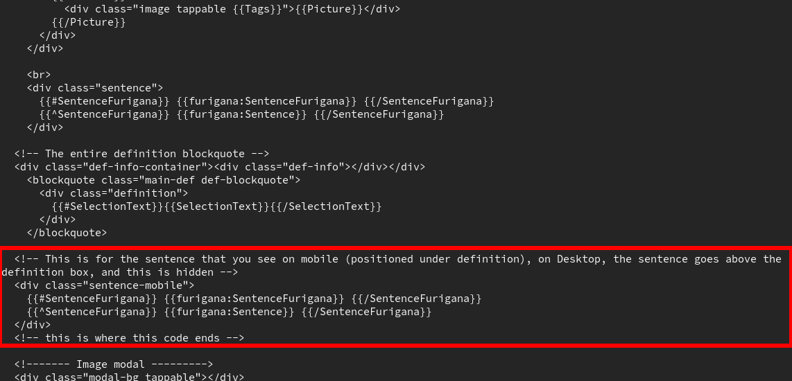
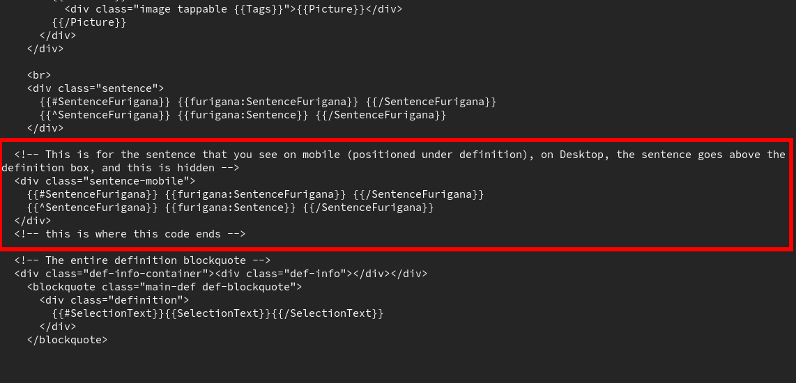

# Lapis

An advanced yet lightweight [Anki](https://apps.ankiweb.net/) notetype, thoughtfully designed to be fast, feature-rich, and compatible.

<div align="center">
  
  <p><em>Click cards with Lapis</em></p>
</div>

### Table of Contents

- [Why was Lapis created?](#why-was-lapis-created)
- [Key Features](#key-features)
- [How to use Lapis](#how-to-use-lapis)
- [FAQ](#faq)
  - [What is all this Anki, notetype and mining stuff?](#what-is-all-this-anki-notetype-and-mining-stuff)
  - [How do I set up sentence furigana?](#how-do-i-set-up-sentence-furigana)
  - [How do I switch from JPMN to Lapis?](#how-do-i-switch-from-jpmn-to-lapis)
  - [How do I use the various card types?](#how-do-i-use-different-card-types)
  - [What does `Hint` do?](#what-does-hint-do)
  - [Why three different fields for definitions?](#why-three-different-fields-for-definitions)
  - [Will this work with tools like JL?](#will-this-work-with-tools-like-jl)
  - [How does tagging work in Lapis?](#can-i-use-tags)
  - [How do I add additional info to the card?](#how-do-i-add-additional-information-to-the-card)
  - [Does Lapis support frequency sorting?](#what-is-frequency-sorting-and-does-lapis-support-it)
  - [How can I change the font size?](#how-can-i-change-the-font-size)
  - [How can I change the fonts used?](#how-can-i-change-the-fonts-used)
  - [How can I change the bold color?](#how-can-i-change-the-bold-color)
  - [How can I move the sentence on mobile?](#how-can-i-move-the-sentence-on-mobile)
  - [I found a bug, where can I report it?](#i-found-a-bug-where-can-i-report-it)
  - [I have a question not covered in the FAQ](#i-have-a-question-not-covered-in-the-faq)
- [Credits](#credits)

## Why was Lapis created?

Lapis was co-created by [Ruri](https://github.com/bewizible) and [kuri](https://github.com/donkuri/) to provide an alternative to the Anki notetype both were using at the time, [Aquafina](https://github.com/Aquafina-water-bottle) and later [arbyste](https://github.com/arbyste/)'s [jp-mining-note](https://arbyste.github.io/jp-mining-note-prerelease/) (abbreviated JPMN henceforth). While this note is fantastic and was a major inspiration for Lapis, we had the following issues with it:

1. The note relied on custom handlebars, many of which are now directly implemented in Yomitan.
2. The heavy amount of JavaScript on the card caused noticeable lag on mobile devices.
3. Its dependency on handlebars meant it wasn’t compatible with tools that don’t support Yomitan or handlebars directly, like [JL](https://github.com/rampaa/JL).
4. While uncommon, the use of custom handlebars and CSS to format definitions meant it sometimes would break dictionary formatting.
5. The source code was auto-generated, making it a real challenge for both developers and non-developers alike to read and customize. This coupled with the complexity of the note meant it was very hard for people to contribute.
6. The original developer of the note sadly went MIA in the summer of 2023, leaving arbyste alone to understand the codebase and fix potential issues. While arbyste has done outstanding work, no further development is planned except for bug fixing.

At the same time, another great notetype caught our eyes, [rudnam](https://github.com/rudnam)'s excellent [JP-study](https://github.com/rudnam/JP-study). **Lapis was made to take the best of both worlds and avoid the issues mentioned above**. Ruri focused on the technical side of the project, writing the code and building the note, while kuri helped design the note, gave feedback and led the project.
**We warmly welcome new contributors!**

## Key features

- This card **doesn’t rely on custom handlebars** at all, meaning it fully supports every Japanese dictionary that Yomitan does, and the chance of something breaking is exceptionally rare.
- You can easily select different types of cards using the `Is...Card` selectors. To do this, simply add an 'x' to the "Is...Card" field of your choice. Make sure to only select one of these. If you ever need to switch card types for many notes at once, you can use [Batch Editing](https://ankiweb.net/shared/info/291119185) to make the change quickly.
- Lapis uses harmonic frequency ranking to create a `FreqSort` field you can use to re-order your new cards by frequency, either manually by using [Advanced Browser](https://ankiweb.net/shared/info/874215009) (see [this explanation](docs/manual_reordering.md) on how to do this), or automatically with [AutoReorder](https://ankiweb.net/shared/info/757527607). **Do be careful with the latter as there have been cases where AutoReorder has reset learned cards to 'new'.**
- Lapis allows you to organizes dictionaries into different fields, making it easier to view information in an organized manner. You can easily choose which dictionaries you'd like to see first, more details [below](#how-to-use-the-card).

## How to use Lapis

To use Lapis, first download the example deck from [Releases](https://github.com/donkuri/lapis/releases). From there, you need to change your fields settings in Yomitan. Start by selecting `Lapis` as the `Model` in Yomitan's `Configure Anki Card Format`. Here is how your fields should be set up:

| Field              | Value                                                                                                                                                      |
| ------------------ | ---------------------------------------------------------------------------------------------------------------------------------------------------------- |
| Expression         | `{expression}`                                                                                                                                             |
| ExpressionFurigana | `{furigana-plain}`                                                                                                                                         |
| ExpressionReading  | `{reading}`                                                                                                                                                |
| ExpressionAudio    | `{audio}`                                                                                                                                                  |
| SelectionText      | `{popup-selection-text}`                                                                                                                                   |
| MainDefinition     | Something like `{single-glossary-jmdict/jitendex}`. Find this by clicking the down arrow next to this field, and finding a dictionary in a similar format. |
| Sentence           | `{cloze-prefix}<b>{cloze-body}</b>{cloze-suffix}`                                                                                                          |
| SentenceFurigana   |                                                                                                                                                            |
| SentenceAudio      |                                                                                                                                                            |
| Picture            |                                                                                                                                                            |
| Glossary           | `{glossary}`                                                                                                                                               |
| Hint               | To understand the usage of this field, refer to [this](#what-does-hint-do)                                                                                 |
| IsHintCard         |                                                                                                                                                            |
| IsClickCard        |                                                                                                                                                            |
| IsSentenceCard     |                                                                                                                                                            |
| PitchPosition      | `{pitch-accent-positions}`                                                                                                                                 |
| Frequency          | `{frequencies}`                                                                                                                                            |
| FreqSort           | `{frequency-harmonic-rank}`                                                                                                                                |
| MiscInfo           |                                                                                                                                                            |

In `MainDefinition`, what you get will depend on the version of JMdict or Jitendex you have. If you decide you do not want to use any bilingual dictionary, simply use your main monolingual dictionary there.

## FAQ

### What is all this Anki, notetype and mining stuff?

Please read the [guide](https://donkuri.github.io/learn-japanese/guide/). For mining, see the [mining setups](https://donkuri.github.io/learn-japanese/mining/).

### How do I set up sentence furigana?

Please refer to [this](docs/anki_setup.md).

### How do I switch from JPMN to Lapis?

Please refer to [this](docs/updating_cards.md). We do not provide other updating guides for every other notes, but this might give you enough information to figure it out on your own.

### How do I use the various card types?

The `is...Card` fields let you select the kind of card you want to use by placing 'x' (or anything really) in one of the fields. Without anything, you get plain old vocab cards. Please only use one selector to avoid bugs. Here are all the possible options:

| Field selected | Effect                                                                |
| -------------- | --------------------------------------------------------------------- |
| IsHintCard     | Displays the `Sentence` field as a hint below the word on the front.  |
| isClickCard    | Makes the word in the front of the card clickable to get the sentence |
| isSentenceCard | The full sentence appears in the front instead of only the word       |

### What does `Hint` do?

The `Hint` field, inspired by Animecards, serves as a tool to provide additional clarification during reviews. You can learn more about it [here](https://animecards.site/ankicards/).

Here’s a brief overview of its usage as described on the Animecards site:

- **Disambiguating readings**: The `Hint` field can help clarify the correct reading when context alone isn’t enough.
  - 武士 (ぶし - もののふ)
  - 海風 (かいふう - うみかぜ)
  - 悪口 (あっこう - わるくち)

Tip: To differentiate between readings, you can specify **音読み** (on'yomi) and **訓読み** (kun'yomi) in the `Hint` field when necessary.
- **Words appearing only in certain contexts**: Some words commonly appear in specific phrases or expressions. Since this context is usually consistent, it’s fine to include it as a hint.
- **Onomatopoeic or kana words**: For words written without kanji, where no semantic clues are provided, adding a hint with context can make the meaning clearer.
- **Making cards easier**: If kanji alone don't provide enough information, or you’ve failed a card repeatedly, the `Hint` field can make reviews more manageable. Use this as a last resort when necessary.

You can read the full explanation [here](https://animecards.site/ankicards/#the-hint-field).

### Why three different fields for definitions?

This is partly inspired by JPMN and its method of organizing dictionaries. There are three main fields:

- `SelectionText` – Use this when you want to highlight a specific sentence or definition from the Yomitan popup. If you don’t need to highlight anything, just leave it empty, it won’t affect the notetype.
- `MainDefinition` – This is where you input the main dictionary you prefer. I highly recommend filling this in. If you're new to Japanese or mining on your own, it’s a good idea to start with a bilingual dictionary like JMDict/Jitendex. Alternatively, you can use your preferred monolingual dictionaries (such as 三省堂, 大辞林, 大辞泉...) by selecting them when configuring Yomitan. **Please note, the dictionaries need to be installed in Yomitan before they can be selected.**
- `Glossary` – This is where you place all of your dictionary definitions. We recommend having more than a single dictionary, see [here](https://donkuri.github.io/learn-japanese/setup/#adding-dictionaries). **If you choose to use only a single dictionary, make sure it is selected in `MainDefinition` and leave this field EMPTY to avoid a known bug.**

### Will this work with tools like JL?

There is a [Setup Guide for JL](docs/jl_setup.md). JL has a couple of drawbacks: it doesn't support external dictionaries and you'll need to use [AJT Japanese](docs/anki_setup.md) to fill in all furigana. Otherwise, Lapis works well with JL. In general, **Lapis should work well with tools that support Yomitan dictionaries but not custom handlebars**.

### How does tagging work in Lapis?

Tags are not added automatically, so you need to add them yourselves in the `Tags` section of Anki. They will appear at the bottom of the card.
For example, the card in the example deck has the tag アニメ:小市民シリーズ at the bottom, indicating [the source](https://anilist.co/anime/173295/Shoushimin-Series). **By default, Yomitan adds a `yomitan` or `yomichan` tag to each of your cards**, you might want to remove that by going to the `Anki` section in your Yomitan settings and taking out the Card tags (it should have `yomitan` or `yomichan` filled in).

### How do I add additional info to the card?

You can use the `MiscInfo` field to add any extra information you'd like. It will then appear at the bottom of the back of the card.

### Does Lapis support frequency sorting?

Yes, using the `FreqSort` field. For an explanation of what frequency sorting is, read [this](https://donkuri.github.io/learn-japanese/mining/#using-frequency-sorting). Basically, for each card `{frequency-harmonic-rank}` computes the [harmonic mean](https://en.wikipedia.org/wiki/Harmonic_mean) of all the frequencies on that card. It is often used when working with ratios and it approaches what the word's _true frequency_ looks like. That is what gets added to `FreqSort` and that is what you need to order by.

### How can I change the font size?

To change the font size, open the `Styling` section of the card in Anki by going to `Browse`, then select a Lapis card and then click on `Cards` (top-left of the card editor). Once there, look for the section at the top labeled `/* PC Font sizes */` or `/* Mobile font sizes */`, which should look like this:

```css
/* PC Font sizes */
--pc-main-font-size: 16px;
--pc-main-def-size: 20px;
--pc-vocab-font-size: 85px;
--pc-back-vocab-font-size: 60px;
--pc-sentence-font-size: 52px;
--pc-back-sentence-font-size: 35px;
--pc-hint-font-size: 38px;
--pc-info-font-size: 23px;

/* Mobile font sizes */
--mobile-main-font-size: 16px;
--mobile-main-def-size: 16px;
--mobile-vocab-font-size: 70px;
--mobile-back-vocab-font-size: 32px;
--mobile-sentence-font-size: 38px;
--mobile-back-sentence-font-size: 24px;
--mobile-hint-font-size: 24px;
--mobile-info-font-size: 16px;
```

You can adjust any of these `px` values to your preferred font size.

### How can I change the fonts used?

To change the font family, open the `Styling` section of the card in Anki by going to `Browse`, then select a Lapis card and then click on `Cards` (top-left of the card editor). In the `Styling` section, look for the part labeled `/* Miscellaneous */`, and you will see this:

```css
--font-serif: serif;
--font-sans: sans-serif;
```

You can replace these with any fonts you prefer, or leave them as is to use the default fonts your operating system uses. If you want a recommendation, we like Hiragino fonts (the default on macOS) and Noto CJK fonts. If you see Chinese instead of Japanese kanji or if you are unsure about this, read [this guide](https://learnjapanese.moe/font/).

### How can I change the bold color?

In case you have the sentence in front with the word bolded, it is bolded in gray. If you want to change that color and you're using the dark theme, look for `--bold: #7d8590;` and change the hexcode to whatever color you want by inputting the hexcode corresponding to that color. For the light theme, it's under `--bold: #999999;`. You can find a hexcode selectors online if you don't know what your color is.

### How can I move the sentence on mobile?

If you want to move a sentence above or below the definition on mobile, follow these steps:

1. Open the `Cards...` section of the card in Anki by going to `Browse` and selecting a Lapis card.
2. In the `Cards...` editor, click on the `Back Template`.
3. Look for the block of code like this:

   

4. To move the sentence above the definition, move this block of code above the definition.

   

However, if you want to move the sentence from above to below the definition, reverse this process.

### I found a bug, where can I report it?

Open an issue and tell us about it on the [issue tracker](https://github.com/donkuri/lapis/issues), we will be more than happy to help you!

### I have a question not covered in the FAQ

You can ask us a question by opening an issue on the [issue tracker](https://github.com/donkuri/lapis/issues).

## Credits

This project could never have happened without the following people:

[Ruri](https://github.com/bewizible) - technical mastermind behind the project, wrote the code and built the card

[kuri](https://github.com/donkuri) - card design, feedback and helped lead the project

[Rudnam](https://github.com/rudnam) - major inspiration for the project, allowed us to reuse their code, fruitful conversations

[Aquafina-water-bottle](https://github.com/Aquafina-water-bottle/) - created jp-mining-note, the main inspiration behind the project

[Arbyste](https://github.com/arbyste/) - maintains jp-mining-note, fruitful conversations

[kuuube](https://github.com/Kuuuube) - helped us figure out a bug with JMdict, fruitful conversations

### Additional thanks

#### kuri

I would like to thank everyone that has helped us here. Some have their names above because they have been major contributors, others simply encouraged us and told us what they would like to see in a new notetype. You know who you are!
I would also like to dedicate this project to Austin. I hope you are well my friend. Thank you for your help, without you my work in the Japanese learning community would have never been a reality.

#### Ruri

I’d like to express my heartfelt thanks to everyone who made this notetype possible. First, a huge thank you to [kuri](https://github.com/donkuri/) for agreeing to collaborate with me on this project. I’ve learned so much thanks to you, and the notetype has improved far more than it ever could have without your help—thank you, truly, from the bottom of my heart.

Next, I’d like to thank [rudnam](https://github.com/rudnam/), whose code laid the foundation for this project. Your clear, functional code made everything so much easier, and your entire logic code (with some modifications) is showcased in Lapis!

Finally, a big thank you to [Aquafina (Austin S.)](https://github.com/Aquafina-water-bottle) and [arbyste](https://github.com/arbyste) for creating and maintaining JPMN, which inspired the UI for Lapis. Your work laid the groundwork for what this project has become.

Last but not least, there’s me, Ruri! I wrote the code (and spent countless hours troubleshooting when things didn’t work the way I expected). I’ve done my best to make the code clear and easy to understand for anyone who wants to contribute—so a big thanks in advance to those who do!
