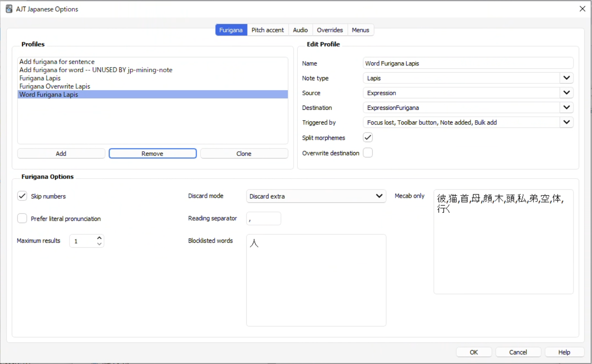

# JL Setup

## Basic Configuration

Once you've got JL installed and connected to AnkiConnect, you'll need to configure it for the Lapis note type. Open the Preferences menu and click on the `Anki` tab. Choose your deck from the `Deck` dropdown, and then select Lapis as the `Note Type`.

Set up your fields according to the following table:

| Field              | Value                                                                                                                                                      |
| ------------------ | ---------------------------------------------------------------------------------------------------------------------------------------------------------- |
| Expression         | `Primary Spelling`                                                                                                                                             |
| ExpressionFurigana | `Nothing`                                                                                                                                         |
| ExpressionReading  | `Readings`                                                                                                                                                |
| ExpressionAudio    | `Audio`                                                                                                                                                  |
| SelectionText      | `Selected Definitions`                                                                                                                                   |
| MainDefinition     | `Definitions`                   |
| Sentence           | `Sentence`                                                                                                          |
| SentenceFurigana   | `Nothing`                                                                                                                                                           |
| SentenceAudio      | `Nothing`                                                                                                                                                           |
| Picture            | `Image`                                                                                                                                                           |
| Glossary           | `Nothing`                                                                                                                                               |
| Hint               | `Nothing`                                                                                                                                                           |
| IsHintCard         | `Nothing`                                                                                                                                                           |
| IsClickCard        | `Nothing`                                                                                                                                                           |
| IsSentenceCard     | `Nothing`                                                                                                                                                           |
| PitchPosition      | `Pitch Accents (Numeric)`                                                                                                                                 |
| Frequency          | `Frequencies`                                                                                                                                            |
| FreqSort           | `Frequency (Harmonic Mean)`                                                                                                                                |
| MiscInfo           | `Nothing`                                                                                                                                                           |

## AJT Configuration

JL doesn't have furigana support, so if you want the ExpressionFurigana and SentenceFurigana, you'll need to set up AJT to support them. To set up the Sentence Furigana, please see [AJT Japanese Setup](anki_setup.md). You'll also need to add a new profile to handle Expresion Furigana. In the AJT Options menu, click `Add` to add a new profile, and set it up like this:

   

     
   

## Limitations

JL does not have support for exporting multiple dictionary definitions, so the Glossary field is not supported with JL.