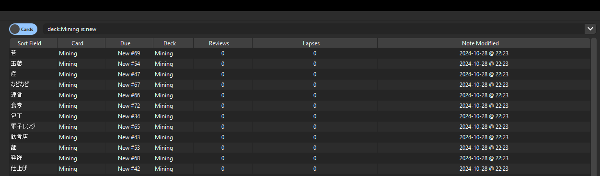
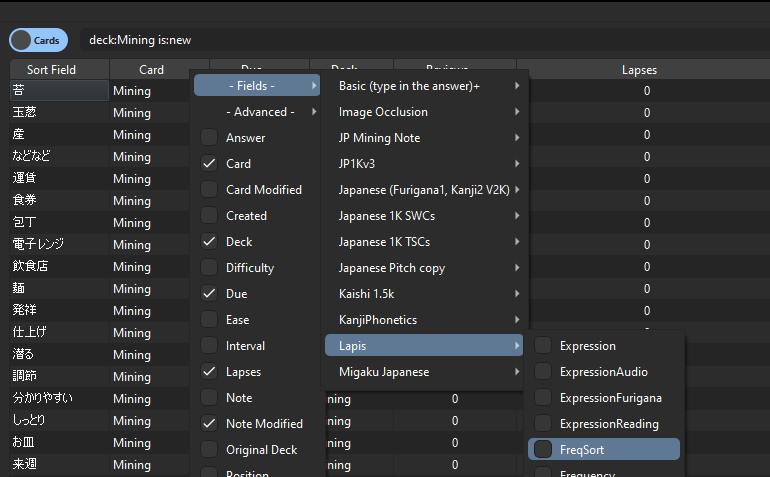
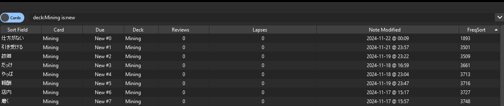
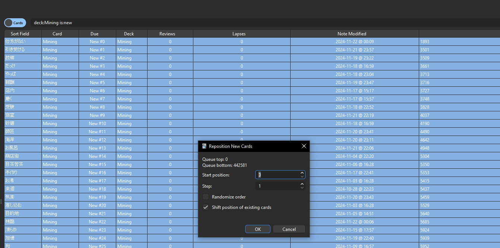

Here is how you can manually re-order cards based on `FreqSort` with the [Advanced Browser addon](https://ankiweb.net/shared/info/874215009). (Thanks to @mcgrizzz for the guide)

1. Go into the browser and limit the search to new cards (so you do not affect already learned cards). Something like **`deck:Mining is:new`** should be in your search bar depending on what your mining deck is called.
 
 
 
2. Right-Click on the headers and go to **`Fields -> Lapis -> FreqSort`** and toggle it.
 
  
 
3. Sort by **`FreqSort`**. The smallest value FreqSort should be at the top.
 
  
 
4. Select all the cards, Right Click and select Reposition then hit OK with these options.
 
  

The new cards should now be sorted according to the `FreqSort` field using the harmonic mean of the frequencies found in each card.
